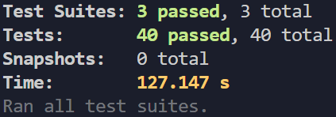

# About Part 4

## The Blog-list App
 The Blog-list app is the final version of the project developed between exercises 4.1 to 4.23.
 This is a backend RESTful app developed to practice testing with the jest package and learning about token authentication.
 Run "npm run dev" to start the server using the "production" database, "npm test" to verify that all tests pass and "npm run start:test" to start the server using the test database.
 The endpoints of this app are: /api/blogs, /api/users, /api/login.
